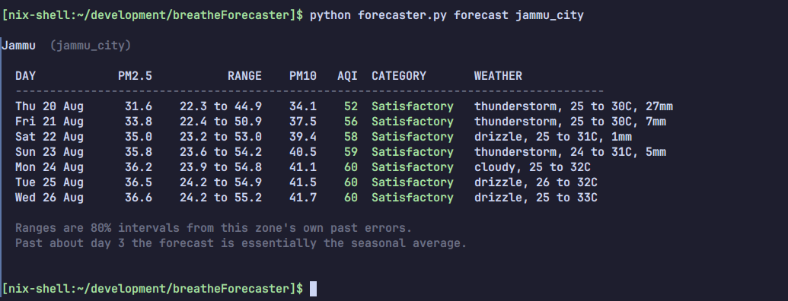

# breatheForecaster

<p align="center">
  
</p>

A dependency free command line forecaster for the **BreatheOSS** network. It reads the zone history served by the Breathe API, fits a small statistical model to it, and prints seven days of PM2.5, PM10 and AQI alongside the weather that drives them. It also keeps a journal of what it predicted, so that the forecasts can be graded once the days have actually happened.

The whole tool is one file and uses nothing outside the Python standard library.

## How the Forecast is Calculated

`[1]` Hourly readings are pulled from `/historical-data` and collapsed into one number per day, in IST.

- A day needs at least **12 valid hourly readings** before it counts.
- Days below that threshold are dropped, never filled in. A day built from three night readings is a biased sample, because the air stops mixing after dark, and quietly imputing it corrupts everything downstream.
- **The day in progress is dropped too**, however many readings it has. The 12 hour rule is the right test for a day with a gap in the middle of it and the wrong test for today: at six in the evening today has 18 readings and passes, but its dirtiest hours have not happened yet. Over the last 30 complete Jammu days a midnight to five o'clock mean runs about 5% below the full day, so an unfinished day both anchors the forecast too low and grades yesterday's forecast against a number that is still moving. This is why a forecast run at noon is anchored on yesterday.

`[2]` Concentrations are converted to natural logarithms.

- Pollution is right skewed. Jammu's daily mean is 49.4 µg/m³ against a median of 36.7, so a handful of very bad days drag any straight average around.
- In logs an error becomes a percentage rather than a count of micrograms, which means the same error means the same thing on a clean day and a filthy one.
- It also makes a negative forecast impossible.

`[3]` The logged series is split into a slow part and a fast part.

$$y_t = \ell_t + a_t$$

- $\ell_t$ is the **level**, a causal trailing mean over the last 14 days. This is the seasonal component: what is normal for this time of year, around here, lately.
- $a_t$ is the **anomaly**, or wobble. It is what today's weather did on top of the season.
- The level only ever looks backwards. A level that could see future days would make every measurement in `backtest` meaningless.

`[4]` The anomaly is assumed to decay by a constant fraction each day.

$$\hat{y}_{t+h} = \ell_t + \varphi^{h}\left(y_t - \ell_t\right)$$

Where:
- **h**: how many days ahead we are forecasting.
- **φ**: the fraction of today's wobble still present tomorrow.
- Because φ is below 1, $\varphi^h$ collapses quickly. At φ = 0.6 you keep 60% of the wobble tomorrow but under 3% a week out, so the forecast becomes the level on its own.

This is not the model giving up. Measured on the Jammu record, the anomaly's autocorrelation is 0.49 at one day, 0.11 at two, and indistinguishable from zero from three days onward. After about two days today's reading genuinely has nothing left to say, and a forecast that keeps leaning on it is worse than one that admits this.

`[5]` **φ is blended toward a regional value**, weighted by how much data the zone actually has.

$$\varphi_{zone} = \frac{n \cdot \hat{\varphi} + \kappa \cdot \varphi_{pooled}}{n + \kappa}, \qquad \kappa = 30$$

- Measuring a correlation from 30 days carries an error of roughly $1/\sqrt{30} \approx 0.18$, which is wide enough to explain the entire spread seen between the short record zones.
- A zone with 208 days is weighted 87% to its own measurement; one with 30 days sits at 50/50; a brand new zone leans almost entirely on the regional value.
- Nobody has to decide when a zone has "enough" data. The arithmetic hands control back to the local sensor a little more every day.

`[6]` **Ranges come from measured error, not from theory.** The tool runs its own walk forward test, takes the standard deviation of the residuals at each lead time, and reports

$$\left[\exp\left(\hat{y} - 1.2816\,\sigma_h\right),\; \exp\left(\hat{y} + 1.2816\,\sigma_h\right)\right]$$

An empirical range absorbs every flaw in the model, including the ones nobody has found yet. `score` then checks whether the 80% range really did contain the truth about 80% of the time, and says so when it did not.

`[7]` **AQI is computed from the forecast concentrations, never forecast directly.** PM2.5 and PM10 are modelled separately and then pushed through the **US EPA** breakpoint tables, copied from the API's own `US_BREAKPOINTS` in `conversions.py` so the two always agree. The PM2.5 rows are the 2024 revision, where Good ends at 9.0 rather than 12.0. The index is a piecewise linear lookup with a maximum over pollutants, which makes it a poor thing to model and a fine thing to derive.

Because the index is derived, it is also **recomputed from the stored concentrations every time the journal is read**, rather than being trusted as recorded. That is what let this tool move from the Indian CPCB index to the EPA one without stranding a single forecast it had already published.

One detail in the lookup is load-bearing. The EPA rows do not touch: PM2.5 runs `[0.0, 9.0]` and then `[9.1, 35.4]`, so a daily mean of 9.05 matches no row at all. Every concentration is therefore truncated to the precision its table is written in, one decimal for PM2.5 and whole micrograms for PM10, exactly as the EPA instructs. Skip that step and a clean day falls through every row and out of the bottom of the function as AQI 500.

## Structure
```
breatheForecaster/
├── forecaster.py       # the entire tool
├── shell.nix           # development shell
├── LICENSE
└── README.md
```

## Main sections
`forecaster.py` is organised into banner separated sections, in the order the data flows through them.

- `COLORS AND CONSTANTS`
  Terminal colours, which switch off when the output is not a tty, plus every tunable number in one place: the level window, the pooled φ, the interval multiplier and the CPCB breakpoint tables.
- `SMALL MATHS HELPERS`
  `average`, `standard_deviation`, `correlation` and `percentile`, written out longhand so the arithmetic can be followed line by line.
- `TALKING TO THE APIS`
  Fetching zones, history and the Open-Meteo weather forecast. Network failures exit with a readable message rather than a stack trace.
- `TURNING READINGS INTO DAILY NUMBERS`
  Hourly buckets to IST days, gap preserving day lists, and the log transform.
- `THE AQI TABLES`
  CPCB sub index interpolation, the max over pollutants, and category names.
- `THE FORECAST MODEL`
  `level_at`, `measure_phi`, `shrink_phi` and `predict_from`. The whole model is four functions.
- `BACKTESTING`
  `walk_forward` and the skill score. Nothing changes in this tool unless it raises the skill score.
- `THE JOURNAL`
  Appending forecasts to a JSONL file and reading them back for grading.
- `COMMANDS` and `MAIN`
  One function per subcommand, then plain argument dispatch.

## Requirements
- python ≥ 3.9
- no third party packages

## Running
From the repository directory:
`python forecaster.py --help`

Or make it executable and put it on your PATH:
```
chmod +x forecaster.py
ln -s "$PWD/forecaster.py" ~/.local/bin/forecaster
```

## Commands

- **Forecast a zone**:
  `forecaster forecast <zone> [--days N] [--json]`

  ```
  Jammu  (jammu_city)

    DAY            PM2.5           RANGE    PM10   AQI  CATEGORY       WEATHER
    ------------------------------------------------------------------------------
    Tue 25 Aug      36.9    26.1 to 52.2    42.0   104  Sensitive      thunderstorm, 24 to 33C, 3mm
    Wed 26 Aug      37.4    25.0 to 56.2    42.9   106  Sensitive      clear, 26 to 34C
    Thu 27 Aug      37.8    25.1 to 56.8    43.3   106  Sensitive      clear, 26 to 33C
  ```

- **Measure it against the baselines**:
  `forecaster backtest <zone> [--days N]`

  Walks the record one day at a time, fitting only on what was known at each point, and prints the typical error against persistence and against a plain 14 day average.

- **Record tonight's forecast**:
  `forecaster record <zone> [--days N]`

  Appends to `$XDG_DATA_HOME/breathe-forecaster/<zone>.jsonl`.

- **Grade the recorded forecasts**:
  `forecaster score <zone>`

  Reports typical error and category accuracy by lead time, whether the published ranges were honest, and the most recent scored days.

- **Print the whole log as markdown**:
  `forecaster report <zone> [--days N]`

  Emits the current forecast, the running scorecard and every past forecast with its actuals filled in, as a markdown document on stdout. This is what regenerates the README in [breatheForecasterResults](https://github.com/sidharthify/breatheForecasterResults) every night.

- **List zones**:
  `forecaster zones`

## Environment Variables
```
BREATHE_API=https://api.breatheoss.app   (optional, point at a local API)
XDG_DATA_HOME=~/.local/share             (optional, where the journal lives)
```

## How good is it
Walk forward on Jammu, 213 usable days, 158 scored forecast origins, everything fitted only on data available at the time.

| | d+1 | d+2 | d+3 | d+4 | d+5 | d+6 | d+7 |
|---|---:|---:|---:|---:|---:|---:|---:|
| persistence | 21.9% | 31.0% | 34.4% | 35.8% | 37.1% | 36.8% | 35.1% |
| 14 day level | 24.1% | 24.7% | 24.7% | 24.7% | 24.4% | 24.1% | 24.2% |
| **this model** | **19.8%** | **24.5%** | **25.0%** | **24.7%** | **24.6%** | **24.1%** | **24.2%** |
| skill vs persistence | +10% | +21% | +27% | +31% | +34% | +34% | +31% |

That is the number to judge the tool on, and it holds up: a fifth off at one day, and a third better than assuming tomorrow looks like today by the end of the week.

**The categorical numbers do not hold up, and should not be quoted.** Against EPA bands the model names the exact category 63% of the time at one day and 53% at seven, and lands within one band 99% of the time throughout. Those look strong until you ask what they should be compared against. Jammu sits in Moderate on 57% of days, so a program consisting of `print("Moderate")` already scores 57%:

| | d+1 | d+2 | d+3 | d+4 | d+5 | d+6 | d+7 |
|---|---:|---:|---:|---:|---:|---:|---:|
| exact category | 63% | 56% | 53% | 57% | 53% | 53% | 53% |
| always saying "Moderate" | 57% | 57% | 57% | 57% | 57% | 57% | 57% |
| **model advantage** | **+6** | -1 | -4 | 0 | -4 | -4 | -4 |

Only day one beats the constant, and Srinagar is worse: it is Moderate on 90% of days and the model does not beat that at any lead. A band is a coarse target and most days in one place fall in the same one. Quote the concentration skill; treat the category as presentation.

Two more things are worth being honest about. The scoring window runs from March to August, which is the cleaner half of the year, so absolute errors in winter will be larger. And the sensor record begins in January 2026, meaning **no autumn or winter has been observed at all**. Everything the tool does in November is extrapolation until it has been through one.

## Development
The rule that governs this repository: **a change is an improvement only if it raises the skill score in `backtest`.** Not if it is more sophisticated, not if it uses more inputs, not if a paper recommends it.

Two things have already been rejected on that basis and should not be reintroduced without new evidence:

1. **Weather covariates.** Rain, wind and mixing depth all correlate with the anomaly with the physically correct sign, but the strongest is only r = -0.30. That explains 9% of the variance, which caps the possible gain at about 5%, while fitting the coefficient on 200 days costs more than that. The signal is real but does not yet pay for the parameter.
2. **Forecasting AQI directly.** The index has kinks at every breakpoint and takes a maximum over pollutants, so it behaves badly as a modelling target. Concentrations are smooth; derive the index afterwards.

Adding a zone needs no code changes. The tool reads `/zones` and works with anything the API reports as `airgradient`, though zones with under 80 usable days will refuse to backtest, and short record zones lean heavily on the pooled φ until they have earned their own.

Forecasts are published nightly and graded in public at [breatheForecasterResults](https://github.com/sidharthify/breatheForecasterResults). That log is the only measurement here that cannot be rebuilt on demand: everything `backtest` reports could be recomputed from scratch tomorrow, but a record of what was said before anyone knew the answer only accumulates at one day per day.

The methodology, the measurements behind every number above, and the open questions are written up separately in the Breathe repository as `aqi-forecasting.md` and `aqi-forecasting-technical-note.md`. Both were written against the CPCB index and their categorical sections are superseded by the table above.
